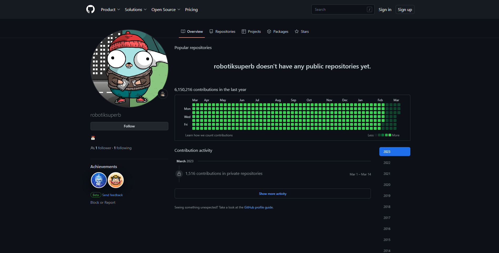

# Contributions farmer

**Use it only if you need to flex about your contributions count.**



WIP, but still you can use it. Just need to fix concurrency to make it blazingly fast.

Generally, the idea of this project was to make it easy to deploy on something like Railway and not use it on local machine. </br>
Anyways you can run it on your local machine.

## Step-by-step

First of all you need to generate two github tokens.

- [Fine-grained access token](https://github.com/settings/tokens?type=beta)
- [Classic token](https://github.com/settings/tokens)

Create your own repository and clone this app (to be able to deploy it on the Railway)

```bash
git clone https://github.com/robotiksuperb/contributions-farmer.git
```

Configure `app.env` file. You can check the example in the `app.env.example`. </br>
ATTENTION! FARMER WILL NOT WORK IF YOU MISS IT

```
ACCESS_TOKEN=
CLASSIC_TOKEN=
USER_NAME=
USER_EMAIL=
```

It's not neccessarry to configure other parameters, but it's on your own.

You can easily change the dates for the farmer in the `main.go` file.

## How-to-run

Local machine:

```bash
make all
```
